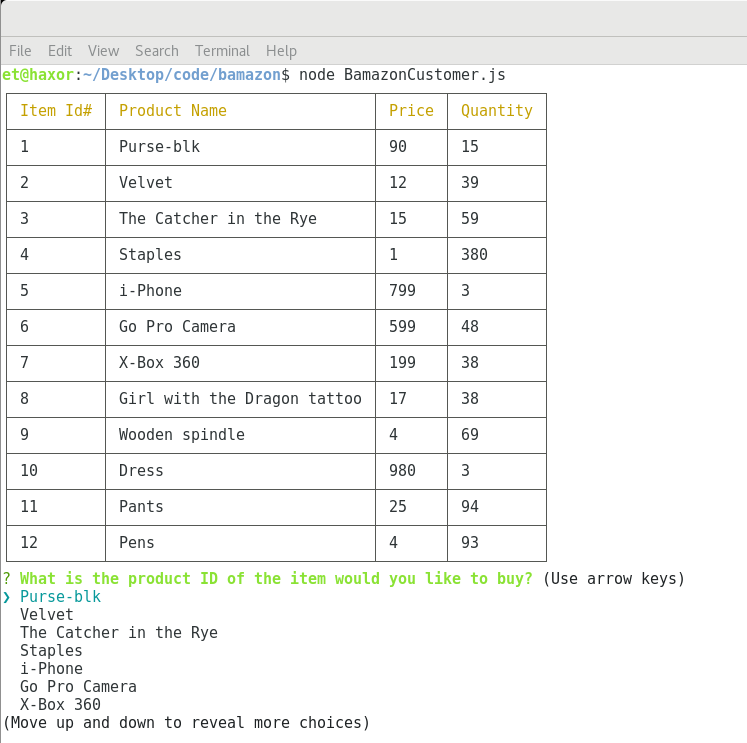

# Bamazon

## Synopsis
***

An interactive shopping node app where MySQL and Node.JS are used to allow users to purchase items as a customer, view, track and update the product inventory as a manager, and track the total sales by department as an executive.

### Bamazon Customer Portal
***

The Bamazon Customer Portal allows users to view the current items available for purchase.  The user will be prompted to select the item they want to purchase and how many items they wish to purchase.  If the item is in stock, the order will be completed and the user will see the total amount of their purchase.

#### Technologies Used:

***

* Javascript
* nodeJS
* MySQL
* npm packages:
	* [mysql](https://www.npmjs.com/package/mysql)
    * [Inquirer.js](https://www.npmjs.com/package/inquirer)
	* [colors](https://www.npmjs.com/package/colors)
	* [cli-table](https://www.npmjs.com/package/cli-table)

#### License

***

Copyright 2016 - 2018 University of Central Florida Coding Bootcamp - Edna Jonsson